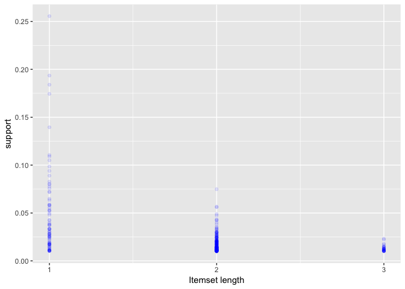
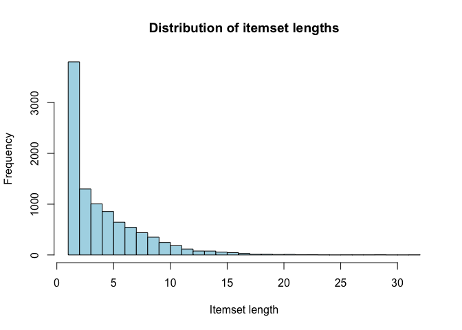
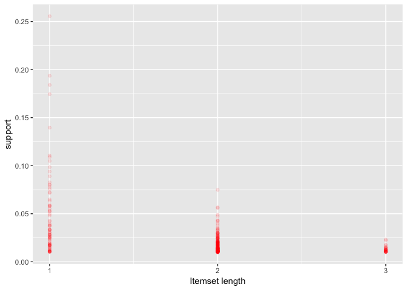
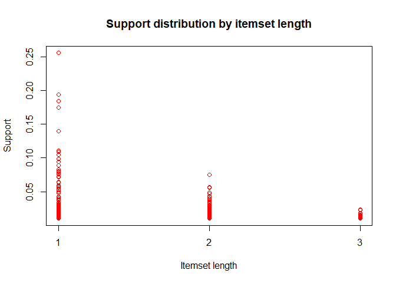
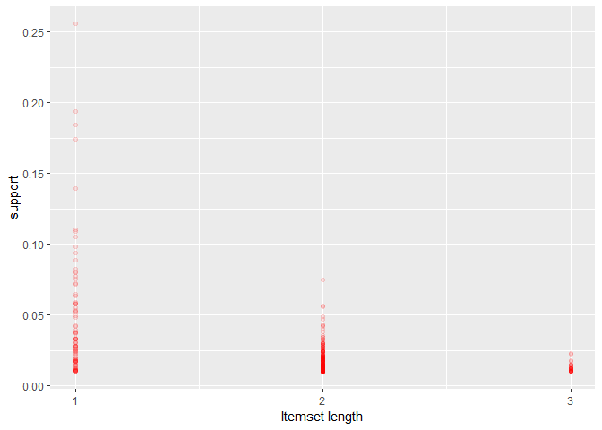
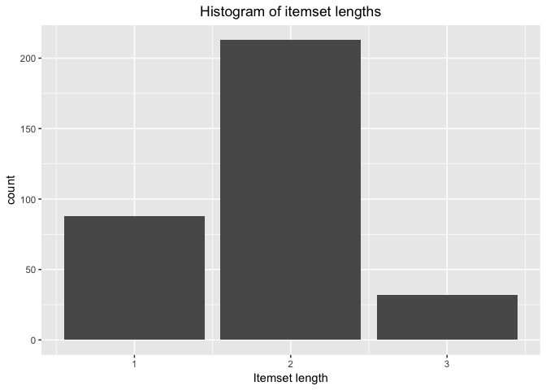
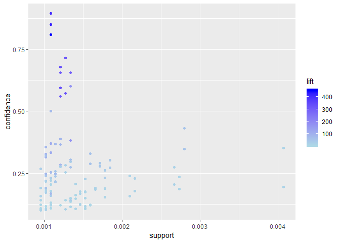

<!-- README.md is generated from README.Rmd. Please edit that file -->
[](https://travis-ci.org/titoeb/Rpriori)

Rpriori
=======

The goal of `Rpriori` is to create association rules of type X=&gt;Y by using the Apriori algorithm. For a more detailed demonstration of how the package works please consider the examples.R file in the examples folder. This `README` only covers the most important features.

Installation
------------

You can install `Rpriori` from github with:

``` r
# install.packages("devtools")
devtools::install_github("abuchmueller/Rpriori")
```

Example: Creating association rules
-----------------------------------

This is a basic example which shows you how to create association rules with `Rpriori` using the `Groceries` dataset.

Before we do that it might be useful to take a look at our data beforehand. Use the `summary()` function of Rpriori to do so:

``` r
summary(Groceries)
#> 
#> Transaction database in binary sparse matrix representation 
#>  with 169 rows (items) and 
#>  9835 columns (itemsets/transactions) and 
#>  a density of 0.0261 (sparsity: 0.9739)
#> 
#> Most frequent items: 
#>       whole milk other vegetables       rolls/buns             soda           yogurt 
#>             2513             1903             1809             1715             1372 
#>    bottled water  root vegetables   tropical fruit 
#>             1087             1072             1032 
#> 
#> Distribution of itemset length:
#> 
#>    1    2    3    4    5    6    7    8    9   10   11   12   13   14   15   16   17   18   19   20 
#> 2159 1643 1299 1005  855  645  545  438  350  246  182  117   78   77   55   46   29   14   14    9 
#>   21   22   23   24   26   27   28   29   32 
#>   11    4    6    1    1    1    1    3    1 
#> 
#>    Min. 1st Qu.  Median    Mean 3rd Qu.    Max. 
#>   1.000   2.000   3.000   4.409   6.000  32.000
```

We have 9835 transactions recorded with a total of 169 items and a density of 0.026. The average basket has 4 items in it.

Now we can try to find frequent items with the `FindFrequentItemsets()` function:

``` r
Frequent <- FindFrequentItemsets(Groceries, minsupport = 0.1)
show(Frequent)
#> Found 8 frequent itemset(s). Use print() to display
```

There are 8 frequent itemsets that occur in one out of ten transactions. If you want to take look at the itemsets now you can use the `print()` function.

``` r
print(Frequent)
#>              items   support
#> 4       whole milk 0.2555160
#> 3 other vegetables 0.1934926
#> 6       rolls/buns 0.1839349
#> 8             soda 0.1743772
#> 5           yogurt 0.1395018
#> 7    bottled water 0.1105236
#> 2  root vegetables 0.1089985
#> 1   tropical fruit 0.1049314
```

To create rules you need to supply `AssociationRules()` with a transactions database and a minimum support threshold. You can additionally set a minimum confidence threshold, the default value for minimal confidence is 0.

``` r
Rules <- AssociationRules(Groceries, minsupport = 0.01, minconfidence = 0.2)
show(Rules)
#> Found 231 rule(s). Use print() to display
```

We found 231 rules Association rules with our specified paramters.

Example: Inspecting data
------------------------

To get summary statistics on rules simply call `summary()`

``` r
summary(Rules)
#> Found 231 rule(s). Use print() to display
#> 
#> 
#> Summary of quality measures:
#>     support          confidence          lift           leverage        
#>  Min.   :0.01007   Min.   :0.2006   Min.   :0.8991   Min.   :-0.004495  
#>  1st Qu.:0.01200   1st Qu.:0.2470   1st Qu.:1.4455   1st Qu.: 0.004608  
#>  Median :0.01474   Median :0.3180   Median :1.7278   Median : 0.006500  
#>  Mean   :0.01903   Mean   :0.3324   Mean   :1.7924   Mean   : 0.007261  
#>  3rd Qu.:0.02222   3rd Qu.:0.4035   3rd Qu.:2.0781   3rd Qu.: 0.008461  
#>  Max.   :0.07483   Max.   :0.5862   Max.   :3.2950   Max.   : 0.026291
```

If you want to take a look at the underlying data used in rule creation there are multiple ways. One way is to use the `extract` function:

``` r
Frequent <- extract(Rules)
summary(Frequent)
#> 
#> Frequent itemsets in binary sparse matrix representation 
#>  with 88 rows (items) and 
#>  333 columns (frequent itemsets)
#> 
#> Most frequent items: 
#>       whole milk other vegetables           yogurt       rolls/buns  root vegetables 
#>               71               63               39               36               34 
#>             soda   tropical fruit          sausage 
#>               28               26               17 
#> 
#> 
#> Observed frequency in frequent itemsets:
#>       whole milk other vegetables           yogurt       rolls/buns  root vegetables 
#>           0.2132           0.1892           0.1171           0.1081           0.1021 
#>             soda   tropical fruit          sausage 
#>           0.0841           0.0781           0.0511 
#> 
#> 
#> Distribution of itemset length:
#> 
#>   1   2   3 
#>  88 213  32 
#> 
#>    Min. 1st Qu.  Median    Mean 3rd Qu.    Max. 
#>   1.000   1.000   2.000   1.832   2.000   3.000 
#> 
#> 
#> Summary of the support measure:
#>    Min. 1st Qu.  Median    Mean 3rd Qu.    Max. 
#> 0.01007 0.01190 0.01627 0.02507 0.02603 0.25552
```

This extracts the frequent itemsets used to calculate association rules. You can also create a frequent itemmatrix directly:

``` r
Frequent2 <- FindFrequentItemsets(Groceries, 0.01)
Frequent2
#> Found 333 frequent itemset(s). Use print() to display
```

Since frequent itemset generation takes a lot longer than rule creation, it might be better to create a frequent item matrix first, and then use `AssociationRules()` to calculate rules.

``` r
fRules <- AssociationRules(Groceries, Frequent, minsupport = 0.03, minconfidence = 0.4)
```

In this case `AssociationRules` won't need to recalculate the frequent item-sets if you do not lower the support threshold.

If you want to take a look at the transactions matrix used to calculate the frequent items you need to create a `TAMatrix` object first:

``` r
Transactions <- makeTAMatrix(Groceries)
summary(Transactions)
#> 
#> Transaction database in binary sparse matrix representation 
#>  with 169 rows (items) and 
#>  9835 columns (itemsets/transactions) and 
#>  a density of 0.0261 (sparsity: 0.9739)
#> 
#> Most frequent items: 
#>       whole milk other vegetables       rolls/buns             soda           yogurt 
#>             2513             1903             1809             1715             1372 
#>    bottled water  root vegetables   tropical fruit 
#>             1087             1072             1032 
#> 
#> Distribution of itemset length:
#> 
#>    1    2    3    4    5    6    7    8    9   10   11   12   13   14   15   16   17   18   19   20 
#> 2159 1643 1299 1005  855  645  545  438  350  246  182  117   78   77   55   46   29   14   14    9 
#>   21   22   23   24   26   27   28   29   32 
#>   11    4    6    1    1    1    1    3    1 
#> 
#>    Min. 1st Qu.  Median    Mean 3rd Qu.    Max. 
#>   1.000   2.000   3.000   4.409   6.000  32.000
```

Example: Visualizing data with `plot()` or `qplot()`
----------------------------------------------------

All classes come with base plotting and `ggplot2` methods. Both `plot()` and `qplot()` only need to be supplied a valid object to work, however `qplot()` is more flexible and can sometimes be supplied with additional arguments like `col`or `alpha`.

### Plotting transactions

``` r
plot(Transactions)
```


``` r
qplot(Transactions)
```



### Plotting frequent items

``` r
plot(Frequent)
```



``` r
qplot(Frequent, type = "scatter", col = "red", alpha = 0.1)
```



### Plotting frequent items (as a histogram)

``` r
hist(Frequent)
```



``` r
qplot(Frequent, type = "hist")
```



### Plotting rules

``` r
plot(Rules)
```


``` r
qplot(Rules)
```



Example: Using convenience functions like `support()`
-----------------------------------------------------

There is a set of convenience functions to access information about the rules quality directly.

``` r
support(Frequent)[1:5]
#> [1] 0.05897306 0.09395018 0.02602949 0.02582613 0.04290798
support(Rules)[1:5]
#> [1] 0.01647178 0.02053889 0.01921708 0.02694459 0.02989324
confidence(Rules)[1:5]
#> [1] 0.2793103 0.3482759 0.3258621 0.2867965 0.3181818
lift(Rules)[1:5]
#> [1] 1.443519 1.363029 1.771616 1.482209 1.245252
leverage(Rules)[1:5]
#> [1] 0.005060933 0.005470332 0.008369877 0.008765919 0.005887463
```

Example: Pruning rules
----------------------

In this example we will use the `Epub` dataset containing the download history of documents from the electronical publiation platform of the Vienna University of Economics and Business Administration.

If you want to find association rules with minimal support of 0.0009 and minimal confidence of 0.1 run:

``` r
rules <- AssociationRules(Epub, 0.0009, 0.1)
```

If you use `qplot` you can see that there are some rules with extremely high lift values.

``` r
qplot(rules)
```



Now imagine you are only interested in rules with a lift value above 300:

``` r
rules_pruned <- prune(rules, Lift = 300)
print(rules_pruned)
#>                  lhs          rhs     Support Confidence     Lift    Leverage
#> 1          {doc_6e9} => {doc_6e7} 0.001271537  0.7142857 321.0000 0.001267575
#> 2          {doc_6e7} => {doc_6e9} 0.001271537  0.5714286 321.0000 0.001267575
#> 3          {doc_6e9} => {doc_6e8} 0.001207960  0.6785714 333.5391 0.001204338
#> 4          {doc_506} => {doc_507} 0.001207960  0.6551724 303.0943 0.001203974
#> 5          {doc_6e8} => {doc_6e9} 0.001207960  0.5937500 333.5391 0.001204338
#> 6          {doc_507} => {doc_506} 0.001207960  0.5588235 303.0943 0.001203974
#> 7 {doc_6e8, doc_6e9} => {doc_6e7} 0.001080806  0.8947368 402.0947 0.001078118
#> 8 {doc_6e7, doc_6e9} => {doc_6e8} 0.001080806  0.8500000 417.8016 0.001078219
#> 9 {doc_6e7, doc_6e8} => {doc_6e9} 0.001080806  0.8095238 454.7500 0.001078429
```

Similarly, you can also prune by confidence and have a look at the rules with confidence of 0.75 or above:

``` r
print(prune(rules, Confidence = 0.75))
#>                  lhs          rhs     Support Confidence     Lift    Leverage
#> 1 {doc_6e8, doc_6e9} => {doc_6e7} 0.001080806  0.8947368 402.0947 0.001078118
#> 2 {doc_6e7, doc_6e9} => {doc_6e8} 0.001080806  0.8500000 417.8016 0.001078219
#> 3 {doc_6e7, doc_6e8} => {doc_6e9} 0.001080806  0.8095238 454.7500 0.001078429
```
