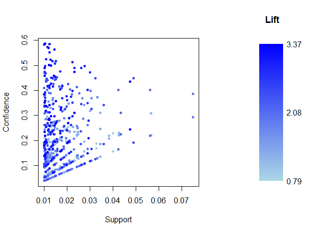
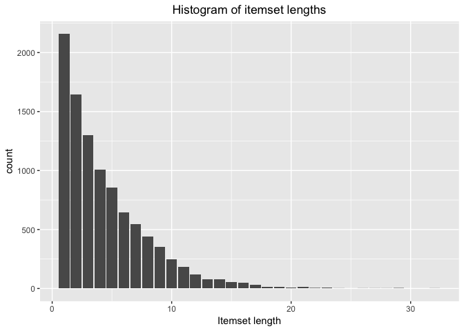
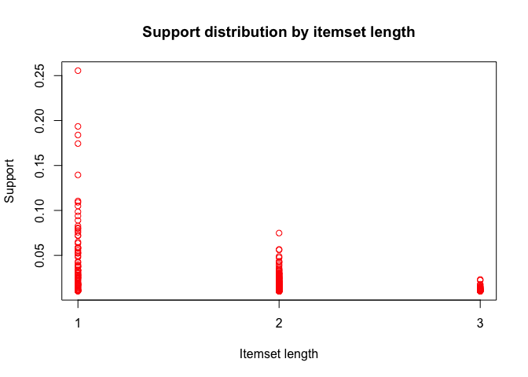
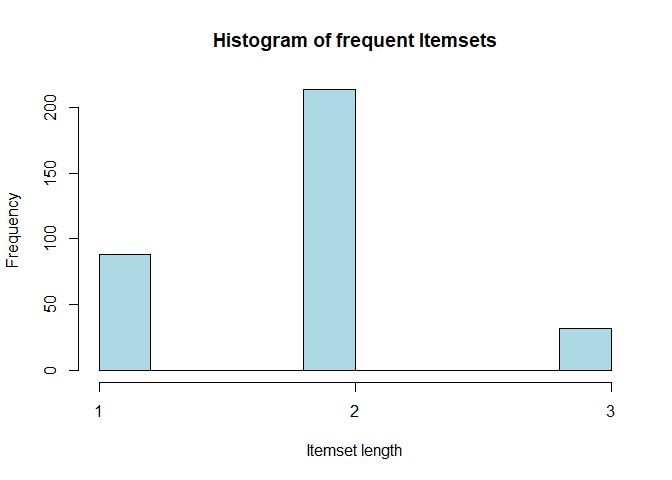

<!-- README.md is generated from README.Rmd. Please edit that file -->
[](https://travis-ci.org/TimToebrock/Rpriori)

Rpriori
=======

The goal of `Rpriori` is to create association rules of type X=&gt;Y by using the Apriori algorithm. For a more detailed demonstration of how the package works please consider the Demo file in the examples folder. This `README` only covers the most important features.

Installation
------------

You can install `Rpriori` from github with:

``` r
# install.packages("devtools")
devtools::install_github("TimToebrock/Rpriori")
```

Example: Creating association rules
-----------------------------------

This is a basic example which shows you how to create association rules with `Rpriori` using the `Groceries` dataset:

``` r
data("Groceries")
Rules <- AssociationRules(Groceries, minsupport = 0.01)
show(Rules)
#> Found 522 rule(s). Use print() to display
```

To create rules you need to supply `AssociationRules()` with a transactions database and a minimum support threshold. You can additionally set a minimum confidence threshold.

Example: Inspecting data
------------------------

To get summary statistics on the rules simply call `summary()`

``` r
summary(Rules)
#> Found 522 rule(s). Use print() to display
#> 
#> 
#> Summary of quality measures:
#>     support          confidence          lift           leverage        
#>  Min.   :0.01007   Min.   :0.0394   Min.   :0.7899   Min.   :-0.004495  
#>  1st Qu.:0.01149   1st Qu.:0.1141   1st Qu.:1.3238   1st Qu.: 0.003568  
#>  Median :0.01388   Median :0.1869   Median :1.5863   Median : 0.005414  
#>  Mean   :0.01718   Mean   :0.2154   Mean   :1.6518   Mean   : 0.005863  
#>  3rd Qu.:0.01973   3rd Qu.:0.2907   3rd Qu.:1.8753   3rd Qu.: 0.007444  
#>  Max.   :0.07483   Max.   :0.5862   Max.   :3.3723   Max.   : 0.026291
```

If you want to take a look at the underlying data used in rule creation there are multiple ways. One way is to use the `extract` function:

``` r
Frequent <- extract(Rules)
summary(Frequent)
#> 
#> Frequent itemsets in binary sparse matrix representation 
#>  with 88 rows (items) and 
#>  333 columns (frequent itemsets)
#> 
#> Most frequent items: 
#>       whole milk other vegetables           yogurt       rolls/buns 
#>               71               63               39               36 
#>  root vegetables             soda   tropical fruit          sausage 
#>               34               28               26               17 
#> 
#> 
#> Observed frequency in frequent itemsets:
#>       whole milk other vegetables           yogurt       rolls/buns 
#>           0.2132           0.1892           0.1171           0.1081 
#>  root vegetables             soda   tropical fruit          sausage 
#>           0.1021           0.0841           0.0781           0.0511 
#> 
#> 
#> Distribution of itemset length:
#> 
#>   1   2   3 
#>  88 213  32 
#> 
#>    Min. 1st Qu.  Median    Mean 3rd Qu.    Max. 
#>   1.000   1.000   2.000   1.832   2.000   3.000 
#> 
#> 
#> Summary of the support measure:
#>    Min. 1st Qu.  Median    Mean 3rd Qu.    Max. 
#> 0.01007 0.01190 0.01627 0.02507 0.02603 0.25552
```

This extracts the frequent itemsets used to calculate association rules. You can also create a frequent itemmatrix directly:

``` r
Frequent2 <- FindFrequentItemsets(Groceries, 0.01)
Frequent2
#> Found 333 frequent itemset(s). Use print() to display
```

Since frequent item-set generation takes a lot longer than rule creation, it might be better to create a frequent item matrix first, and then use `AssociationRules()` to calculate rules.

``` r
fRules <- AssociationRules(Groceries, Frequent, minsupport = 0.03, minconfidence = 0.4)
```

In this case `AssociationRules` won't need to recalculate the frequent item-sets if you do not lower the support threshold.

If you want to take a look at the transactions matrix used to calculate the frequent items you need to create a `TAMatrix` object first:

``` r
Transactions <- makeTAMatrix(Groceries)
summary(Transactions)
#> 
#> Transaction database in binary sparse matrix representation 
#>  with 169 rows (items) and 
#>  9835 columns (itemsets/transactions) and 
#>  a density of 0.0261 (sparsity: 0.9739)
#> 
#> Most frequent items: 
#>       whole milk other vegetables       rolls/buns             soda 
#>             2513             1903             1809             1715 
#>           yogurt    bottled water  root vegetables   tropical fruit 
#>             1372             1087             1072             1032 
#> 
#> Distribution of itemset length:
#> 
#>    1    2    3    4    5    6    7    8    9   10   11   12   13   14   15 
#> 2159 1643 1299 1005  855  645  545  438  350  246  182  117   78   77   55 
#>   16   17   18   19   20   21   22   23   24   26   27   28   29   32 
#>   46   29   14   14    9   11    4    6    1    1    1    1    3    1 
#> 
#>    Min. 1st Qu.  Median    Mean 3rd Qu.    Max. 
#>   1.000   2.000   3.000   4.409   6.000  32.000
```

Example: Visualizing data with `plot()` or `qplot()`
----------------------------------------------------

All classes come with base plotting and `ggplot2` methods. Both `plot()` and `qplot()` only need to be supplied a valid object to work, however `qplot()` is more flexible and can sometimes be supplied with additional arguments like `col`or `alpha`.

### Plotting transactions

``` r
plot(Transactions)
```



``` r
qplot(Transactions)
```



### Plotting frequent items

``` r
plot(Frequent)
```



``` r
qplot(Frequent, type = "scatter", col = "red", alpha = 0.1)
```


### Plotting frequent items (as a histogram)

``` r
hist(Frequent)
```



``` r
qplot(Frequent, type = "hist")
```


### Plotting rules

``` r
plot(Rules)
```


``` r
qplot(Rules)
```


Example: Using convenience functions like `support()`
-----------------------------------------------------

There are a set of convenience functions to access certain slots easily.

``` r
support(Frequent)[1:5]
#> [1] 0.05897306 0.09395018 0.02602949 0.02582613 0.04290798
support(Rules)[1:5]
#> [1] 0.01006609 0.01006609 0.01016777 0.01016777 0.01647178
confidence(Rules)[1:5]
#> [1] 0.10714286 0.17068966 0.09328358 0.17241379 0.08512874
lift(Rules)[1:5]
#> [1] 1.816810 1.816810 1.581800 1.581800 1.443519
leverage(Rules)[1:5]
#> [1] 0.004525561 0.004525561 0.003739795 0.003739795 0.005060933
```
